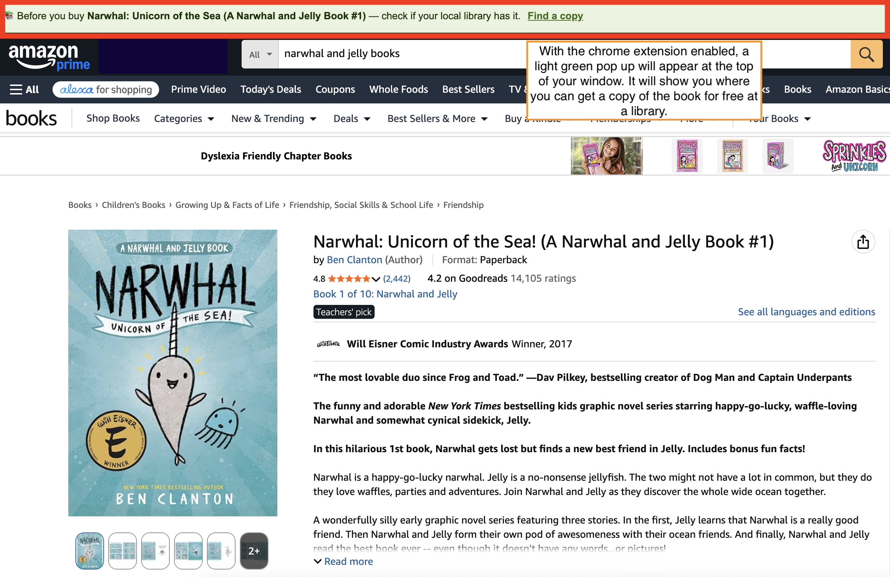

# Library Finder

A Chrome extension that catches you before you buy a book online and shows you a free way to read it instead — borrow it digitally through Open Library, or find it at your local library.



## How it works

When you land on a book's product page, a content script scans the page for an ISBN. If it finds one, it sends that ISBN to the extension's background service worker, which checks Open Library for the book's details and its digital lending status. A small banner then appears on the page with one of two messages:

- **Available to borrow free online** — links straight to that book on Open Library.
- **Check your library** — links to a WorldCat search for that exact edition (by ISBN, so it matches precisely rather than guessing from the title). WorldCat's site auto-detects your location and sorts results by nearest library.

No ISBN on the page means no banner — the extension does nothing on non-book pages.

## Status

Phase 1 complete: Amazon only, core detection and banner working. See [PROGRESS.md](PROGRESS.md) for the full decision log, what's done, and what's next.

**Supported today:** amazon.com
**Planned:** barnesandnoble.com, target.com, walmart.com, booksamillion.com

## Why not WorldCat's API or Libby?

WorldCat's free developer API shut down at the end of 2024; the current version requires an institutional library subscription, which isn't accessible to an indie project. Libby (OverDrive) has no public API at all — it's institutional-partnership-only. Both are dead ends for a project like this, so v1 uses Open Library's free, no-key APIs for book data and digital lending, and links out to WorldCat's public website for local library search.

Real-time physical availability at a specific branch would require integrating with individual library systems that publish their own APIs (NYPL is one example) — that's a possible v2 direction, not something this version does.

## Load it in Chrome

1. Go to `chrome://extensions/`
2. Toggle **Developer mode** on (top right)
3. Click **Load unpacked** and select the `library-finder` folder
4. Visit any Amazon book product page — the banner should appear
5. After any code change, click the refresh icon on the extension's card in `chrome://extensions/`

## Project structure

```
library-finder/
├── manifest.json              Manifest V3 config
├── background.js              Service worker — all Open Library API calls
├── content_scripts/
│   └── amazon.js               ISBN detection + banner injection for Amazon
├── ui/
│   ├── banner.css               Banner styling
│   └── popup.html               Extension popup (placeholder, Phase 4)
├── utils/
│   ├── isbn.js                  ISBN-10/13 validation and normalization
│   └── library-api.js           Open Library Books API + Read API wrapper
└── assets/icons/                Extension icons (16/48/128px)
```

## Privacy

See [PRIVACY.md](PRIVACY.md) — the short version: the extension reads page text to find ISBNs, sends only the ISBN to Open Library's API, and stores or tracks nothing.
